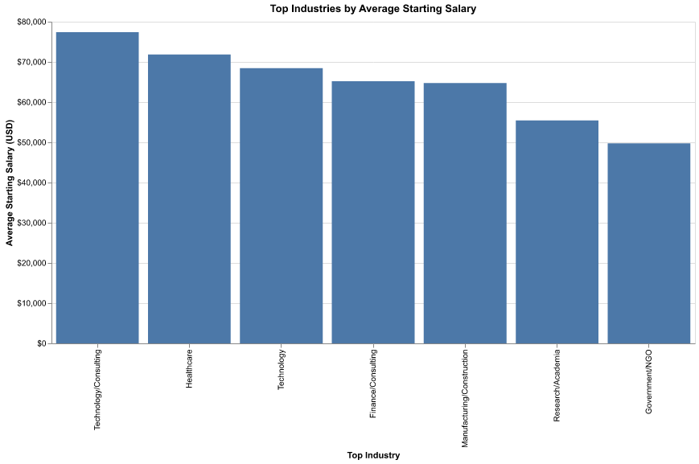
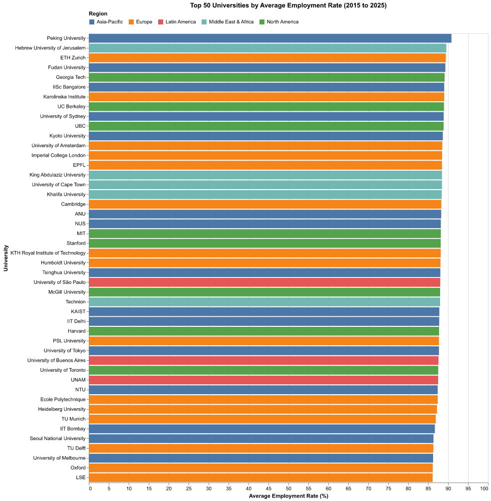
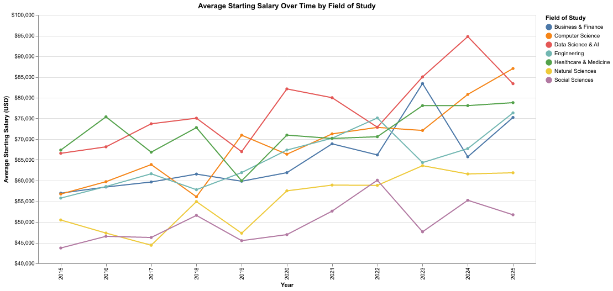

# Milestone 1 Proposal

## Section 1: Motivation and Purpose

## Section 2: Description of the Data

This synthetic dataset offers a detailed view of how graduate employment trends changed between 2015 and 2025. Spanning major universities across regions worldwide, it includes key indicators such as starting salaries (standardised to USD), employment rates at 6 and 12 months after graduation, and changing demand for in-demand skills like AI, Data Science, and Cybersecurity.

Each row represents a unique combination of: University, Year, Degree level, Field of study and job role.

The fields go as follows:

| Column name | Description | Counts | Relevant info | A description of the variable | Relevance |
|---|---|---:|---|---|---|
| Country | University location country | 3500 | Distinct categories: 21 | Identifies the country where the university is based. |  |
| Region | Broad world region | 3500 | Distinct categories: 5 | Groups each record into a global region (e.g., North America, Europe) for regional comparisons. |  |
| University_Name | University name | 3500 | Distinct categories: 46 | The institution attended by the graduate; useful for benchmarking outcomes by university. |  |
| Degree_Level | Degree type completed | 3500 | Distinct categories: 3 | The level of the completed qualification (e.g., Bachelor, Master, PhD). |  |
| Field_of_Study | Academic discipline | 3500 | Distinct categories: 7 | The graduate’s study area (e.g., Computer Science, Engineering), used to compare outcomes across disciplines. |  |
| Graduation_Year | Graduation year | 3500 | Min: 2015.00 • Mean: 2020.02 • Median: 2020.00 • Max: 2025.00 | The year the student graduated (2015–2025), enabling time-based trend analyses. |  |
| Employment_Rate_6_Months (%) | Employment within 6 months | 3500 | Min: 65.50 • Mean: 85.74 • Median: 85.60 • Max: 99.00 | Percentage of graduates employed within six months after graduation. |  |
| Employment_Rate_12_Months (%) | Employment within 12 months | 3500 | Min: 68.00 • Mean: 90.41 • Median: 90.60 • Max: 100.00 | Percentage of graduates employed within twelve months after graduation. |  |
| Average_Starting_Salary_USD | Starting salary (USD) | 3500 | Min: -1200.00 • Mean: 64668.00 • Median: 63900.00 • Max: 189400.00 | Average starting salary for graduates, standardized to USD for cross-country comparability. |  |
| Top_Industry | Typical graduate industry | 3500 | Distinct categories: 7 | The most common industry sector graduates enter, useful for sector-level outcome comparisons. |  |
| Job_Role | Graduate job title/role | 3500 | Distinct categories: 29 | The specific professional role associated with the graduate outcome record (e.g., Data Analyst, Software Engineer). |  |
| Skill_1 | Primary in-demand skill | 3500 | Distinct categories: 34 | The main skill most associated with success in the role (technical or soft skill). |  |
| Skill_2 | Secondary skill | 3500 | Distinct categories: 34 | A complementary skill that supports performance and progression in the role/field. |  |
| Skill_3 | Tertiary skill | 3500 | Distinct categories: 34 | An additional competency commonly linked to the job role or industry expectations. |  |
| Skill_Demand_Score (1–100) | Market demand index | 3500 | Min: 30.00 • Mean: 65.19 • Median: 64.00 • Max: 100.00 | An index (1–100) approximating how strongly the labor market demands the graduate’s skill profile. |  |
| Remote_Work_Availability (%) | Remote work availability | 3500 | Min: 5.00 • Mean: 40.06 • Median: 37.30 • Max: 90.00 | Estimated share (%) of roles in this field that offer remote work options. |  |
| Employer_Reputation_Score (1–100) | Employer reputation score | 3500 | Min: 40.00 • Mean: 69.74 • Median: 70.00 • Max: 100.00 | A score (1–100) reflecting perceived employer reputation/standing relevant to graduate outcomes. |  |
| Year | Analysis year index | 3500 | Min: 2015.00 • Mean: 2020.02 • Median: 2020.00 • Max: 2025.00 | Duplicates `Graduation_Year` to make time-series analysis and indexing simpler. |  |

## Section 3: Research Questions & Usage Scenarios

## Section 4: Exploratory Data Analysis

Our dataset highlights key outcomes across institutions, degree levels, and programs, including salary trends, employability, and how much companies trust graduates from each school. This information can help current students and prospective users pinpoint the industries and disciplines that best match their goals, while also setting clear expectations for what graduation can realistically lead to. In the plots below, we bring these insights together into a concise snapshot of the factors that often shape program decisions. This is especially valuable for anyone weighing multiple paths and wondering where to focus their time and effort. From an economic perspective, it offers a practical, data-backed foundation for making a confident, well-informed choice.

For better context, you can dive into our [EDA notebook](../notebooks/eda_analysis.ipynb).

## Section 5: App Sketch & Description

This app contains several types of visualizations related to employment outcomes
of different university programs. Featured are summary statistics, trends,
and overall rankings. These are illustrated with the cards at the top that aggregate
the underlying data to provide the user with a high-level unfiltered overview.

On the left-sided sidebar, the first two filters allow the user to select
what location they are interested in - with 'Country' allowing for more granularity
when compared to 'Region'. The user can apply the subsequent two filters to select the
field and industries of their choice. The 'Graduation Year' slider provides the user
the ability to investigate different date ranges they may be interested in or, for
example, a more recent period. All filters will update the visuals on the right.

The center charts each provide a breakdown of a specific aspect of the dataset. The
doughnut chart depicts the proportion of degree levels. Additionally, there are two
bar charts to highlight popular universities and industries. And, finally, the user
will be able to gauge the starting salary trend over time.
