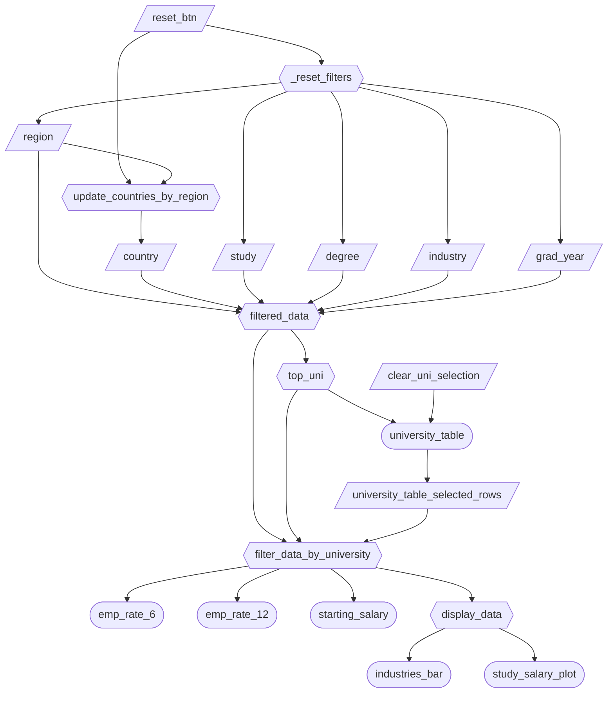

# Dashboard Specifications

Here are the dashboard specs for M2:

## Job Stories

## Job Stories

| #   | Job Story | Status | Notes |
| --- | --- | --- | --- |
| 1 | As a prospective graduate student, I want to filter employment outcomes by field of study, degree level, region, country, and graduation year so that I can compare employment rates and salary outcomes across contexts. | 🔄 Revised | Originally focused more narrowly on degree level and field of study in M1. Revised in M2 after implementing a broader filter panel with region, country, industry, degree, and graduation year controls. The current job story reflects the sidebar functionality in the working dashboard while still preserving the original comparison goal. |
| 2 | As a student exploring job opportunities, I want to compare top industries in my field so that I can target high-demand and high-paying sectors. | ✅ Implemented | Implemented through the dynamic "Top Industries by Average Starting Salary" bar chart. The chart updates based on sidebar filters and university table selection, allowing users to compare salary outcomes across industries within the filtered subset. |
| 3 | As a career advisor, I want to visualize employment rates at both 6 and 12 months so that I can evaluate short-term versus longer-term employment stability for graduates. | ✅ Implemented | Implemented using summary KPI cards displaying Q1, median, Q3, and mean values for 6-month and 12-month employment rates. These values update based on the active filters and selected universities, allowing focused comparison of short-term versus longer-term outcomes. |
| 4 | As a university administrator, I want to rank and interactively explore top-performing universities under selected filters so that I can benchmark institutional performance. | 🔄 Revised | Originally described as viewing top-performing universities in a chart. Revised after implementing a ranked DataGrid with row selection. Selecting universities updates downstream views, enabling more detailed benchmarking analysis than the original chart-based idea. |

## Component Inventory

## Component Inventory

| ID | Type | Shiny widget / renderer | Depends on | Job Stories |
|----|------|-------------------------|------------|-------------|
| `region` | Input | `ui.input_checkbox_group()` | - | #1, #2, #3, #4 |
| `country` | Input | `ui.input_checkbox_group()` | - | #1, #2, #3, #4 |
| `study` | Input | `ui.input_checkbox_group()` | - | #1, #2, #3, #4 |
| `degree` | Input | `ui.input_checkbox_group()` | - | #1, #3 |
| `industry` | Input | `ui.input_checkbox_group()` | - | #1, #2, #3, #4 |
| `grad_year` | Input | `ui.input_slider()` | - | #1, #2, #3, #4 |
| `reset_btn` | Input | `ui.input_action_button()` | - | #1, #2, #3, #4 |
| `clear_uni_selection` | Input | `ui.input_action_button()` | - | #2, #3, #4 |
| `university_table_selected_rows` | Input | DataGrid row selection (generated by `university_table`) | `university_table` | #2, #3, #4 |
| `_reset_filters` | Reactive effect | `@reactive.effect` + `@reactive.event(input.reset_btn)` | `reset_btn` | #1, #2, #3, #4 |
| `update_countries_by_region` | Reactive effect | `@reactive.effect` + `@reactive.event(input.region, input.reset_btn)` | `region`, `reset_btn` | #1, #2, #3, #4 |
| `filtered_data` | Reactive calc | `@reactive.calc` | `region`, `country`, `study`, `degree`, `industry`, `grad_year` | #1, #2, #3, #4 |
| `top_uni` | Reactive calc | `@reactive.calc` | `filtered_data` | #4 |
| `filter_data_by_university` | Reactive calc | `@reactive.calc` | `filtered_data`, `top_uni`, `university_table_selected_rows` | #2, #3, #4 |
| `display_data` | Reactive calc | `@reactive.calc` | `filter_data_by_university` | #1, #2 |
| `emp_rate_6` | Output | `@render.ui` | `filter_data_by_university` | #3 |
| `emp_rate_12` | Output | `@render.ui` | `filter_data_by_university` | #3 |
| `starting_salary` | Output | `@render.ui` | `filter_data_by_university` | #1 |
| `university_table` | Output | `@render.data_frame` + `render.DataGrid()` | `top_uni`, `clear_uni_selection` | #4 |
| `industries_bar` | Output | `@render_altair` | `display_data` | #2 |
| `study_salary_plot` | Output | `@render_altair` | `display_data` | #1 |

## Reactivity Diagram

## Calculation Details

### `filtered_data`

**Depends on:**

- `region`
- `country`
- `study`
- `industry`
- `grad_year`
- `degree`

**Transformations performed:**

- Starts from the full dataset (`raw_data`)
- Filters rows to those where:
  - `Graduation_Year` falls within the selected slider range (inclusive).
  - `Region` is in the selected regions.
  - `Country` is in the selected countries (dynamically updated based on region).
  - `Field_of_Study` is in the selected study fields.
  - `Top_Industry` is in the selected industries.
  - `Degree_Level` is in the selected degree levels.
- Returns the fully filtered subset of the dataset.

**Outputs that consume it:**

- `top_uni`
- `filter_data_by_university`

### `top_uni`

**Depends on:**

- `filtered_data`

**Transformations performed:**

- Groups the filtered dataset by:
  - `University_Name`
  - `Region`
  - `Country`
- Computes:
  - Mean 6-month employment rate
  - Mean 12-month employment rate
- Computes an overall employment metric (`mean_overall`) as the average of the 6-month and 12-month mean employment rates.
- Ranks universities using dense ranking in descending order of `mean_overall`.
- Sorts universities by:
  - Highest overall employment rate
  - Alphabetical university name (tie-breaker)
- Returns the ranked university-level summary table.

**Outputs that consume it:**

- `university_table`
- `filter_data_by_university`

### `filter_data_by_university`

**Depends on:**

- `filtered_data`
- `top_uni`
- `university_table_selected_rows`

**Transformations performed:**

- Retrieves selected row indices from the interactive university DataGrid.
- If no university is selected, it returns the full `filtered_data`.
- If one or more universities are selected:
  - Maps selected row indices to the corresponding university names in `top_uni`.
  - Filters `filtered_data` to include only those selected universities.
- Returns a university-filtered subset for downstream visualizations. 

**Outputs that consume it:**

- `emp_rate_6`
- `emp_rate_12`
- `starting_salary`
- `display_data`

### `display_data`

**Depends on:**

- `filter_data_by_university`

**Transformations performed:**

- Validates that the university-filtered subset is not empty before attempting to render the linked charts.
- Cancels chart output rendering when the selected combination of filters would otherwise produce an empty chart state.
- Returns the validated dataset used by the Altair outputs.

**Outputs that consume it:**

- `industries_bar`
- `study_salary_plot`

## Complexity Enhancement

This prototype implements two interaction enhancements that improve the user experience:

1. **Reset button**
   - The `reset_btn` control restores the main filters to their default state.
   - This supports fast exploration because users can recover from a narrow or confusing filter combination without manually reselecting every widget.

2. **Table row selection driving linked outputs**
   - The `Top Universities` DataGrid supports row selection.
   - Selected universities feed the downstream KPI cards and charts through `filter_data_by_university`.
   - This is especially useful for Job Story 4 because users can move from ranking to focused comparison in a single interaction.