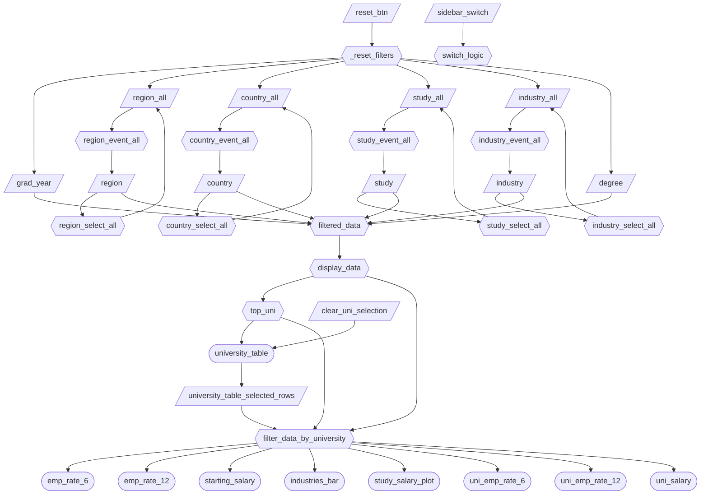
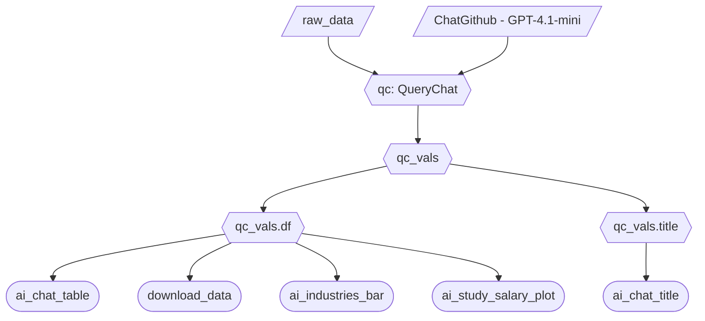

# Dashboard Specifications

Here are the dashboard specs for M4:

## Job Stories

| # | Job Story | Status | Notes |
| --- | --- | --- | --- |
| 1 | As a prospective graduate student, I want to filter employment outcomes by field of study, degree level, region, country, and graduation year so that I can compare employment rates and salary outcomes across contexts. | 🔄 Revised | Originally focused more narrowly on degree level and field of study in M1. Revised in M2 after implementing a broader filter panel with region, country, industry, degree, and graduation year controls. The current job story reflects the sidebar functionality in the working dashboard while still preserving the original comparison goal. |
| 2 | As a student exploring job opportunities, I want to compare top industries in my field so that I can target high-demand and high-paying sectors. | ✅ Implemented | Implemented through the dynamic "Top Industries by Average Starting Salary" bar chart. The chart updates based on sidebar filters and university table selection, allowing users to compare salary outcomes across industries within the filtered subset. |
| 3 | As a career advisor, I want to visualize employment rates at both 6 and 12 months so that I can evaluate short-term versus longer-term employment stability for graduates. | ✅ Implemented | Implemented using summary KPI cards for 6-month and 12-month employment rates, plus side-by-side university comparison charts that respond to table row selection. The KPI cards display Q1, median, Q3, and mean values for the currently filtered subset, while the comparison views support focused benchmarking when one or more universities are selected. |
| 4 | As a university administrator, I want to rank and interactively explore top-performing universities under selected filters so that I can benchmark institutional performance. | 🔄 Revised | Originally described as viewing top-performing universities in a chart. Revised after implementing a ranked DataGrid with row selection and linked comparison outputs. Selecting universities now updates downstream KPI cards, salary views, and side-by-side university comparison charts, enabling more detailed benchmarking analysis than the original chart-based idea. |
| 5 | As a graduate or prospective student, I want to query the dataset in plain English so that I can explore employment outcomes without manually adjusting multiple filter controls. | ✅ Implemented | Implemented via the AI Assistant tab using `querychat` and `ChatGithub` (GPT-4.1-mini). Natural language input filters the full dataset reactively and drives a data table, two charts and a CSV download. |

## Component Inventory

### 1. Main Dashboard

| ID | Type | Shiny widget / renderer | Depends on | Job Stories |
| ---- | ------ | ------------------------- | ------------ | ------------- |
| `region` | Input | `ui.input_checkbox_group()` | - | #1, #2, #3, #4 |
| `region_all` | Input | `ui.input_checkbox()` | - | #1, #2, #3, #4 |
| `country` | Input | `ui.input_checkbox_group()` | - | #1, #2, #3, #4 |
| `country_all` | Input | `ui.input_checkbox()` | - | #1, #2, #3, #4 |
| `study` | Input | `ui.input_checkbox_group()` | - | #1, #2, #3, #4 |
| `study_all` | Input | `ui.input_checkbox()` | - | #1, #2, #3, #4 |
| `degree` | Input | `ui.input_checkbox_group()` | - | #1, #3 |
| `industry` | Input | `ui.input_checkbox_group()` | - | #1, #2, #3, #4 |
| `industry_all` | Input | `ui.input_checkbox()` | - | #1, #2, #3, #4 |
| `grad_year` | Input | `ui.input_slider()` | - | #1, #2, #3, #4 |
| `reset_btn` | Input | `ui.input_action_button()` | - | #1, #2, #3, #4 |
| `sidebar_switch` | Input | `ui.input_switch()` | - | #1, #2, #3, #4 |
| `clear_uni_selection` | Input | `ui.input_action_button()` | - | #2, #3, #4 |
| `university_table_selected_rows` | Input | DataGrid row selection (generated by `university_table`) | `university_table` | #2, #3, #4 |
| `_reset_filters` | Reactive effect | `@reactive.effect` + `@reactive.event(input.reset_btn)` | `reset_btn` | #1, #2, #3, #4 |
| `switch_logic` | Reactive effect | `@reactive.effect` + `@reactive.event(input.sidebar_switch)` | `sidebar_switch` | #1, #2, #3, #4 |
| `region_event_all` | Reactive effect | `@reactive.effect` + `@reactive.event(input.region_all)` | `region_all`, `region` | #1, #2, #3, #4 |
| `region_select_all` | Reactive effect | `@reactive.effect` + `@reactive.event(input.region)` | `region` | #1, #2, #3, #4 |
| `country_event_all` | Reactive effect | `@reactive.effect` + `@reactive.event(input.country_all)` | `country_all`, `country` | #1, #2, #3, #4 |
| `country_select_all` | Reactive effect | `@reactive.effect` + `@reactive.event(input.country)` | `country` | #1, #2, #3, #4 |
| `study_event_all` | Reactive effect | `@reactive.effect` + `@reactive.event(input.study_all)` | `study_all`, `study` | #1, #2, #3, #4 |
| `study_select_all` | Reactive effect | `@reactive.effect` + `@reactive.event(input.study)` | `study` | #1, #2, #3, #4 |
| `industry_event_all` | Reactive effect | `@reactive.effect` + `@reactive.event(input.industry_all)` | `industry_all`, `industry` | #1, #2, #3, #4 |
| `industry_select_all` | Reactive effect | `@reactive.effect` + `@reactive.event(input.industry)` | `industry` | #1, #2, #3, #4 |
| `filtered_data` | Reactive calc | `@reactive.calc` | `region`, `country`, `study`, `degree`, `industry`, `grad_year` | #1, #2, #3, #4 |
| `display_data` | Reactive calc | `@reactive.calc` | `filtered_data` | #1, #2, #3, #4 |
| `top_uni` | Reactive calc | `@reactive.calc` | `display_data` | #4 |
| `filter_data_by_university` | Reactive calc | `@reactive.calc` | `display_data`, `top_uni`, `university_table_selected_rows` | #2, #3, #4 |
| `emp_rate_6` | Output | `@render.ui` | `filter_data_by_university` | #3 |
| `emp_rate_12` | Output | `@render.ui` | `filter_data_by_university` | #3 |
| `starting_salary` | Output | `@render.ui` | `filter_data_by_university` | #1 |
| `university_table` | Output | `@render.data_frame` + `render.DataGrid()` | `top_uni`, `clear_uni_selection` | #4 |
| `industries_bar` | Output | `@render_altair` | `filter_data_by_university` | #2 |
| `study_salary_plot` | Output | `@render_altair` | `filter_data_by_university` | #1 |
| `uni_emp_rate_6` | Output | `@render_altair` | `filter_data_by_university`, `university_table_selected_rows` | #3, #4 |
| `uni_emp_rate_12` | Output | `@render_altair` | `filter_data_by_university`, `university_table_selected_rows` | #3, #4 |
| `uni_salary` | Output | `@render_altair` | `filter_data_by_university`, `university_table_selected_rows` | #1, #4 |

### 2. AI Assistant Tab

| ID | Type | Shiny widget / renderer | Depends on | Job Stories |
| ---- | ------ | ------------------------- | ------------ | ------------- |
| `qc` (QueryChat instance) | AI module | `querychat.QueryChat()` | `raw_data`, `ChatGithub(gpt-4.1-mini)` | #5 |
| `qc.sidebar()` | UI element | `querychat` sidebar | `qc` | #5 |
| `qc_vals` | Reactive values | `qc.server()` | `qc` | #5 |
| `qc_vals.df()` | Reactive calc | QueryChat reactive dataframe | `qc_vals` | #5 |
| `qc_vals.title()` | Reactive calc | QueryChat reactive title string | `qc_vals` | #5 |
| `ai_chat_title` | Output | `@render.text` | `qc_vals.title()` | #5 |
| `ai_chat_table` | Output | `@render.data_frame` | `qc_vals.df()` | #5 |
| `download_data` | Output | `@render.download` | `qc_vals.df()` | #5 |
| `ai_industries_bar` | Output | `@render_altair` | `qc_vals.df()` | #5 |
| `ai_study_salary_plot` | Output | `@render_altair` | `qc_vals.df()` | #5 |

## Reactivity Diagram

### 1. Main Dashboard RD

```mermaid
flowchart TD
  reset_btn[/reset_btn/] --> _reset_filters{{_reset_filters}}
  sidebar_switch[/sidebar_switch/] --> switch_logic{{switch_logic}}

  _reset_filters --> grad_year[/grad_year/]
  _reset_filters --> region_all[/region_all/]
  _reset_filters --> country_all[/country_all/]
  _reset_filters --> study_all[/study_all/]
  _reset_filters --> industry_all[/industry_all/]
  _reset_filters --> degree[/degree/]

  region_all --> region_event_all{{region_event_all}}
  region_event_all --> region[/region/]
  region --> region_select_all{{region_select_all}}
  region_select_all --> region_all

  country_all --> country_event_all{{country_event_all}}
  country_event_all --> country[/country/]
  country --> country_select_all{{country_select_all}}
  country_select_all --> country_all

  study_all --> study_event_all{{study_event_all}}
  study_event_all --> study[/study/]
  study --> study_select_all{{study_select_all}}
  study_select_all --> study_all

  industry_all --> industry_event_all{{industry_event_all}}
  industry_event_all --> industry[/industry/]
  industry --> industry_select_all{{industry_select_all}}
  industry_select_all --> industry_all

  region & country & study & degree & industry & grad_year --> filtered_data{{filtered_data}}
  filtered_data --> display_data{{display_data}}
  display_data --> top_uni{{top_uni}}

  top_uni --> university_table([university_table])
  clear_uni_selection[/clear_uni_selection/] --> university_table
  university_table --> university_table_selected_rows[/university_table_selected_rows/]

  display_data & top_uni & university_table_selected_rows --> filter_data_by_university{{filter_data_by_university}}

  filter_data_by_university --> emp_rate_6([emp_rate_6])
  filter_data_by_university --> emp_rate_12([emp_rate_12])
  filter_data_by_university --> starting_salary([starting_salary])
  filter_data_by_university --> industries_bar([industries_bar])
  filter_data_by_university --> study_salary_plot([study_salary_plot])
  filter_data_by_university --> uni_emp_rate_6([uni_emp_rate_6])
  filter_data_by_university --> uni_emp_rate_12([uni_emp_rate_12])
  filter_data_by_university --> uni_salary([uni_salary])
```

### 2. AI Assistant Tab RD

```mermaid
flowchart TD
  raw_data[/raw_data/] --> qc{{qc: QueryChat}}
  ChatGithub[/ChatGithub - GPT-4.1-mini/] --> qc

  qc --> qc_vals{{qc_vals}}
  qc_vals --> qc_df{{qc_vals.df}}
  qc_vals --> qc_title{{qc_vals.title}}

  qc_df --> ai_chat_table([ai_chat_table])
  qc_df --> download_data([download_data])
  qc_df --> ai_industries_bar([ai_industries_bar])
  qc_df --> ai_study_salary_plot([ai_study_salary_plot])
  qc_title --> ai_chat_title([ai_chat_title])
```

## Calculation Details

### 1. Main Dashboard CD

#### `filtered_data`

**Depends on:**

- `region`
- `country`
- `study`
- `industry`
- `grad_year`
- `degree`

**Transformations performed:**

- Starts from the full dataset (`raw_data`) as a lazy DuckDB-backed ibis table.
- Filters rows to those where:
  - `Graduation_Year` falls within the selected slider range (inclusive).
  - `Region` is in the selected regions.
  - `Country` is in the selected countries.
  - `Field_of_Study` is in the selected study fields.
  - `Top_Industry` is in the selected industries.
  - `Degree_Level` is in the selected degree levels.
- Returns the filtered lazy query without storing it as a pandas DataFrame yet.

**Outputs that consume it:**

- `display_data`

#### `display_data`

**Depends on:**

- `filtered_data`

**Transformations performed:**

- Executes the lazy filtered ibis query and materializes it as a pandas DataFrame.
- Validates that the filtered subset is not empty before downstream ranking or chart rendering.
- Cancels output rendering when the selected combination of filters would otherwise produce an empty dashboard state.
- Returns the validated materialized dataset used by downstream calculations.

**Outputs that consume it:**

- `top_uni`
- `filter_data_by_university`

#### `top_uni`

**Depends on:**

- `display_data`

**Transformations performed:**

- Calls the shared helper `compute_top_universities(display_data())`.
- Groups the filtered dataset by:
  - `University_Name`
  - `Region`
  - `Country`
- Computes:
  - Mean 6-month employment rate
  - Mean 12-month employment rate
- Computes an overall employment metric (`mean_overall`) as the average of the 6-month and 12-month mean employment rates.
- Ranks universities using dense ranking in descending order of `mean_overall`.
- Sorts universities by:
  - Highest overall employment rate
  - Alphabetical university name (tie-breaker)
- Returns the ranked university-level summary table.

**Outputs that consume it:**

- `university_table`
- `filter_data_by_university`

#### `filter_data_by_university`

**Depends on:**

- `display_data`
- `top_uni`
- `university_table_selected_rows`

**Transformations performed:**

- Starts from the validated filtered dataset returned by `display_data`.
- If the filtered dataset is empty, returns the empty DataFrame unchanged.
- Retrieves selected row indices from the interactive university DataGrid.
- If no university is selected, returns the full filtered dataset.
- If one or more universities are selected:
  - Validates selected row indices against the current ranked university table.
  - Maps valid row indices to the corresponding university names in `top_uni`.
  - Filters `display_data` to include only those selected universities.
- Returns a university-filtered subset for downstream KPI cards and charts.

**Outputs that consume it:**

- `emp_rate_6`
- `emp_rate_12`
- `starting_salary`
- `industries_bar`
- `study_salary_plot`
- `uni_emp_rate_6`
- `uni_emp_rate_12`
- `uni_salary`

#### `uni_emp_rate_6`, `uni_emp_rate_12`, and `uni_salary`

**Depends on:**

- `filter_data_by_university`
- `university_table_selected_rows`

**Transformations performed:**

- Use a shared plotting function to aggregate mean values by university for the selected subset.
- When one or more universities are selected, render one bar per selected university.
- When no universities are selected, render a single `All` bar using the mean of the full filtered subset.
- Include `Country` and `Region` in the tooltip to support cross-context comparison.

**Outputs that consume it:**

- None. These are terminal visual outputs.

### 2. AI Assistant Tab CD

#### `qc_vals.df()`

**Depends on:**

- `qc_vals` (QueryChat reactive state, updated on each user message)

**Transformations performed:**

- Reactively returns the DataFrame resulting from the LLM-generated filter applied to `raw_data`.
- When no query has been issued, returns the full unfiltered dataset.
- Updates all downstream outputs whenever the user submits a new message.

**Outputs that consume it:**

- `ai_chat_table`
- `download_data`
- `ai_industries_bar`
- `ai_study_salary_plot`

#### `qc_vals.title()`

**Depends on:**

- `qc_vals` (QueryChat reactive state, updated on each user message)

**Transformations performed:**

- Reactively returns a plain-English string summarising the active query (generated by QueryChat).
- Falls back to `"Graduate Employability Dataset"` when no query has been submitted.

**Outputs that consume it:**

- `ai_chat_title`

## Complexity Enhancement

This prototype implements four interaction enhancements that improve the user experience:

1. **Reset button**
   - The `reset_btn` control restores the main filters to their default state.
   - This supports fast exploration because users can recover from a narrow or confusing filter combination without manually reselecting every widget.

2. **Accordion visibility and Select All filter controls**
   - The `sidebar_switch` lets users open or close all filter dropdowns at once.
   - The `region_all`, `country_all`, `study_all`, and `industry_all` controls provide consistent Select All behavior across the checkbox groups.
   - Together, these improve the experience when users want to scan all options quickly or reset broad filter categories.

3. **Table row selection driving linked outputs**
   - The `Top Universities` DataGrid supports row selection.
   - Selected universities feed the downstream KPI cards, salary views, and side-by-side comparison charts through `filter_data_by_university`.
   - When no university is selected, the comparison charts fall back to an aggregated `All` view.

4. **Natural language querying with linked visualizations**
   - The AI Assistant tab replaces manual filtering with a single free-text chat input.
   - Each query reactively updates four outputs simultaneously: the data table, the CSV download, the industry salary bar chart, and the yearly salary line chart.
   - Suggested starter queries lower the barrier to entry for users unfamiliar with the dataset structure.
   - The CSV download button lets users export exactly the subset the model filtered, supporting offline analysis.

## M4 Feedback Integration

### Critical items addressed

- **AI Assistant layout and scroll behavior**: The AI Assistant tab was reorganized so the page remains readable during longer chats, with the conversation area contained more cleanly within the tab layout. Addressed from feedback items #71 and #85. Owner: [@apoorva43]. PR: [#95].
- **Select All filter refactor**: Shared Select All logic was implemented for Region, Country, Field of Study, and Industry so reset and manual selection behave consistently. Addressed from feedback item #93. Owner: [@Harrisonlee0530]. PR: [#100].

### Non-critical items addressed

- **Accessibility improvements**: KPI supporting text was enlarged and the graduation year slider was moved higher in the sidebar to improve scanning and readability. Addressed from feedback item #101. Owner: [@beardw]. PR: [#105].
- **Chart clarity improvements**: The Top Industries view and related chart styling were clarified to reduce ambiguity and visual inconsistency. Addressed from feedback items #83, #84, and #85. Owner: [@Harrisonlee0530]. PR: [#100].
- **Baseline clarification**: KPI comparison baselines were updated to compare against the last available graduation year globally, making the default benchmark easier to interpret. Addressed from feedback item #85. Owner: [@hpalafoxp]. PR: [#107].
- **Contributor setup documentation**: The README now documents the AI tab and local `.env` setup for contributors running the app locally. Addressed from feedback item #82. Owner: [@apoorva43]. PR: [#96].
