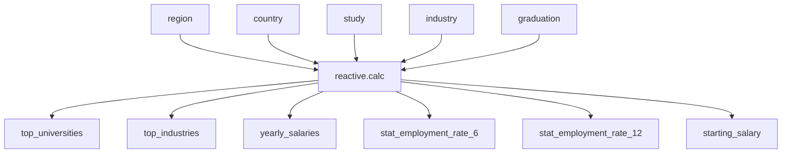

# Dashboard Specifications

Here are the dashboard specs for M2:

## Job Stories

Table

## Component Inventory

| ID            | Type          | Shiny widget / renderer | Depends on                   | Job story  |
| ------------- | ------------- | ----------------------- | ---------------------------- | ---------- |
| `input_year`  | Input         | `ui.input_slider()`     | —                            | #1, #2     |
| `filtered_df` | Reactive calc | `@reactive.calc`        | `input_year`, `input_region` | #1, #2, #3 |
| `plot_trend`  | Output        | `@render.plot`          | `filtered_df`                | #1         |
| `tbl_summary` | Output        | `@render.data_frame`    | `filtered_df`                | #2         |

## Reactivity Diagram

## Calculation Details

Descriptions 