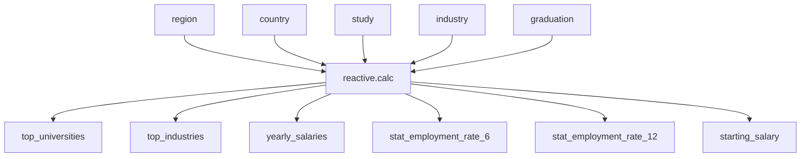

# Dashboard Specifications

Here are the dashboard specs for M2:

## Job Stories

Table

## Component Inventory

| ID | Type | Shiny widget / renderer | Depends on | Job Stories |
|----|------|-------------------------|------------|-------------|
| `region` | Input | `ui.input_checkbox_group()`  | - | #1, #2, #3, #4 |
| `country` | Input | `ui.input_checkbox_group()` | - | #1, #2, #3, #4 |
| `study` | Input | `ui.input_checkbox_group()` | - | #1, #2, #3, #4 |
| `degree_level` | Input | `ui.input_checkbox_group()` | - | #1 |
| `industry` | Input | `ui.input_checkbox_group()` | - | #1, #2, #3, #4 |
| `grad_year` | Input | `ui.input_slider()` | - | #1, #2, #3, #4 |
| `reset_btn` | Input | `ui.input_action_button()` | - | #1, #2, #3, #4 |
| `_reset_filters` | Reactive effect | `@reactive.effect` + `@reactive.event(input.reset_btn)` | `reset_btn` | #1, #2, #3, #4 |
| `filtered_data` | Reactive calc | `@reactive.calc` | `region`, `country`, `study`, `degree_level`, `industry`, `grad_year` | #1, #2, #3, #4 |
| `emp_rate_6` | Output | `@render.ui` | `filtered_data` | #3 |
| `emp_rate_12` | Output | `@render.ui` | `filtered_data` | #3 |
| `starting_salary` | Output | `@render.ui` | `filtered_data` | #1 |
| `update_countries_by_region` | Reactive effect | `@reactive.effect` + `@reactive.event(input.region, input.reset_btn)` | `region`, `reset_btn` | #1, #2, #3, #4 |
| `top_uni` | Reactive calc | `@reactive.calc` | `filtered_data` | #4 |
| `university_table` | Output | `@render.data_frame` + `@render.DataGrid()` | `top_uni` | #4 |
| `university_table_selected_rows` | Input | DataGrid row selection (generated by `university_table`) | `university_table` | #2, #4 |
| `filter_data_by_university` | Reactive calc | `@reactive.calc` | `filtered_data`, `top_uni`, `university_table_selected_rows` | #2, #4 |
| `industries_bar` | Output | `@render_altair` | `filter_data_by_university` | #2 |
| `study_salary_plot` | Output | `@render_altair` | `filter_data_by_university`, `university_table_selected_rows` | #1 |

## Reactivity Diagram

## Calculation Details

Descriptions 